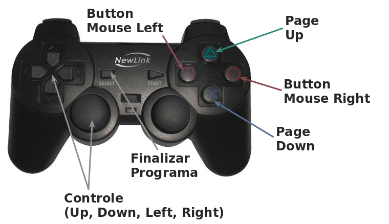
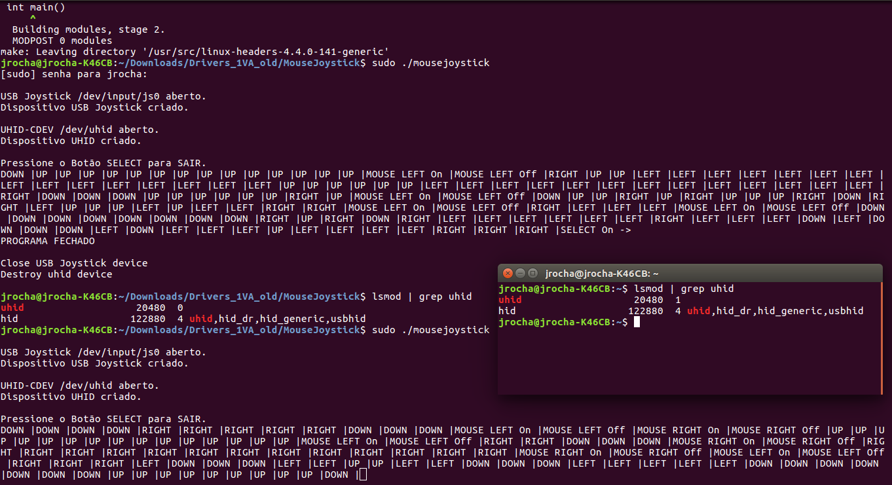
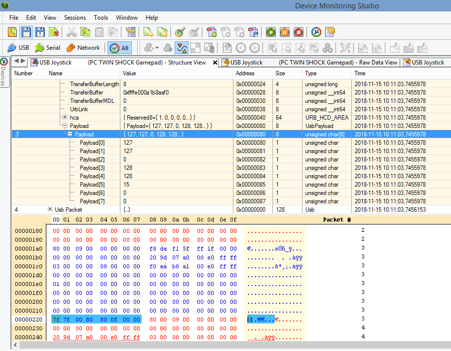
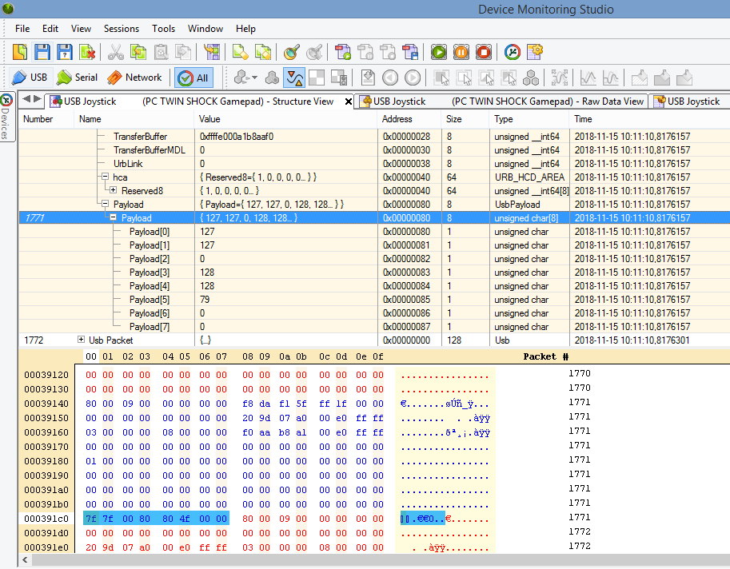
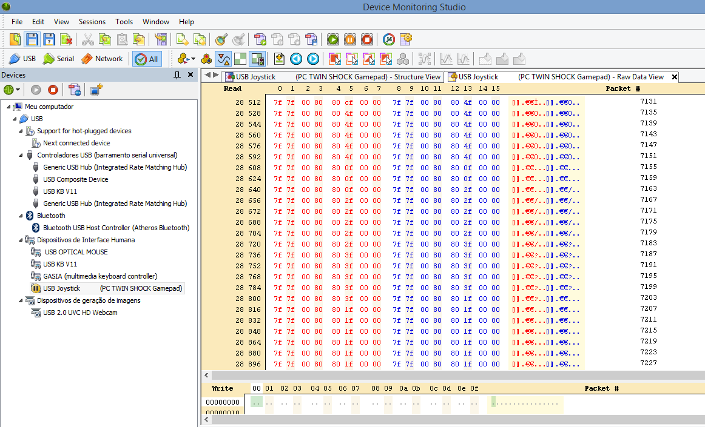

# MouseJoystick

  Este programa faz com que um Joystick seja usado para controlar o Mouse do computador. Segue uma breve descrição dos passos utilizados no seu desenvolvimento.

Os comandos básicos implementados foram:

TRIANGLE --------------- PAGE UP 
BALL ----------------------- BUTTON MOUSE RIGHT 
X (CROSS) --------------- PAGE DOWN 
SQUARE ------------------ BUTTON MOUSE LEFT 
SELECT ------------------- EXIT 

E principalmente os comandos de controle da posição do mouse: (UP, DOWN, LEFT, RIGHT)

Segue figura mostrando os comandos:

## 1 - Joystick USB

Para obter informações sobre o Joystick, deve-se abrir o terminal no Linux e usar o comando:

__$ lsusb -v__

O resultado pode ser visualizado no arquivo: [Joystick lsusb -v.pdf](https://github.com/jobsonrp/MouseJoystick/blob/master/Docs/Joystick%20lsusb%20-v.pdf)

Ao plugar o Joystick no computador, um dispositivo é automaticamente criado na pasta

__/dev/input/jsX__

Onde X é um número associado ao dispositivo. Como, só havia um Joystick conectado, o número associado foi 0 (zero).
 
Comando para testar o Joystick 
__$ sudo jstest /dev/input/jsX__

Informações mais detalhadas sobre o dispositivo js0 
__$ udevadm info -a -n /dev/input/js0__

## 2 - Programa

  O programa foi implementado na linguagem C, e para rodá-lo deve-se fazer o clone deste repositório, acessar a pasta MouseJoystick/MouseJoystick pelo terminal e executar os comandos abaixo:

__$ make -C /lib/modules/$(uname -r)/build M=$PWD modules__

em seguida,

__$ sudo ./mousejoystick__

Segue abaixo a execução do programa via Terminal.

__Informações do computador usado na implementação:__ 
Distribuição Linux: Ubuntu 16.04 LTS 
Versão do Kernel: 4.4.0-141-generic

## 3- Links:

Este código lê eventos do joystick e/ou gamepad no Linux e os exibe no terminal 
https://gist.github.com/jasonwhite/c5b2048c15993d285130

Torvalds/linux - Biblioteca do joystick para Linux 
https://github.com/torvalds/linux/blob/master/include/uapi/linux/joystick.h

Código para controlar o Mouse pelo Teclado do Computador 
https://github.com/martinezjavier/linux/blob/master/samples/uhid/uhid-example.c

Documentação do HID 
https://git.kernel.org/pub/scm/linux/kernel/git/torvalds/linux.git/tree/Documentation/hid

Documentação do Joystick API 
https://android.googlesource.com/kernel/msm/+/android-msm-bullhead-3.10-marshmallow-dr/Documentation/input/joystick-api.txt

Documentação do Joystick API (Txt) 
https://www.kernel.org/doc/Documentation/input/joystick-api.txt

## Anexo - Outros Dispositivos:

  Para outros dispositivos que não são reconhecidos automaticamente pelo sistema, pode-se tentar realizar engenharia reversa. Para isto será necessário capturar os pacotes do dispositivo conectado via USB, RS-232, Bluetooth, etc.

  Foi feito um teste com o mesmo Joystick USB a fim de entender como os dados são transmitidos ao pressionar seus comandos (botões). Segue abaixo uma sequência de prints retirados durante as capturas realizadas com o software __Device Monitoring Studio__ (Instalado no Windows 8):

Captura do sinal padrão enviado constantemente pelo Joystick:

Captura do sinal enviado ao pressionar o botão X do Joystick:

Captura do sinal enviado ao pressionar vários botões em sequência:

Então, sabendo as informações sobre os pacotes enviados, como endereços, tamanho e formatos dos pacotes, será possível criar drivers para estes outros dispositivos.

